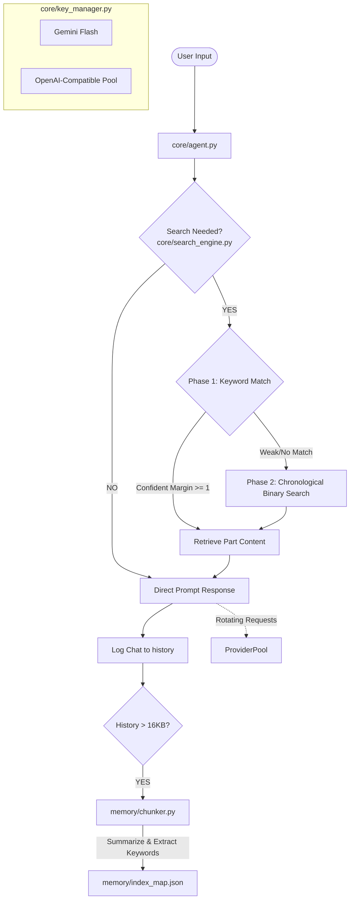

# Blissful Bardeen: Dialogue Agent with Long-Term Memory

Blissful Bardeen is a terminal-based chat agent that implements an advanced long-term memory architecture and a universal, rotating API provider pool. It supports automatic conversation log chunking, intent-based memory search, self-improving keyword indexing, and failover API endpoint rotation.

---

## Architecture Overview



The system operates across three core divisions:
1. **Dialogue Agent (`core/agent.py`)**: Manages the interactive prompt, records exchange logs, and automatically chunks memory once size limits are reached.
2. **Memory Architecture (`memory/chunker.py` & `core/search_engine.py`)**: Partitions conversation history, extracts keywords (preserving text order), and implements a two-phase retrieval lookup:
   - **Phase 1 (Keyword Match)**: Fast keyword overlap check with a confidence margin.
   - **Phase 2 (Binary Search)**: Narrowing down chronological segments using directional queries (BEFORE / AFTER).
   - **Self-Improvement**: Retrospective queries dynamically update key indices.
3. **Rotating Provider Pool (`core/key_manager.py`)**: Cycles through multiple Gemini and OpenAI-compatible API keys to tolerate rate-limiting and connection issues.

---

## File Structure

```
├── core/
│   ├── agent.py          # Terminal dialogue loop and auto-chunk scheduler
│   ├── key_manager.py    # Rotation, HTTP payloads, and error count management
│   ├── search_engine.py  # Two-phase memory retrieval and keyword tokenization
│   └── setup_keys.py     # Interactive CLI setup wizard for API keys
├── memory/               # Git-ignored directory containing history chunks & index_map.json
├── keys.json             # Git-ignored JSON file hosting configured API keys
└── README.md             # Project documentation
```

---

## Module Reference

### 1. Universal Rotating Provider Pool (`core/key_manager.py`)
- Exposes a unified `get_response(prompt)` function.
- Parses a mix of Gemini keys and OpenAI-compatible endpoints (e.g. Groq, OpenRouter, Nvidia NIM) in a unified pool.
- Standardizes OpenAI completions using `{base_url}/chat/completions` with Bearer auth.
- Rotates endpoints on failure. Enforces a strict cap of 3 consecutive failures to safeguard usage, resetting the error count to zero upon any successful API call.

### 2. API Key Setup Wizard (`core/setup_keys.py`)
An interactive CLI helper wizard. Launch it using:
```powershell
python core/setup_keys.py
```
- **Option 1**: Appends Gemini keys directly.
- **Option 2**: Adds OpenAI-compatible keys. If the provider name exists (e.g. `groq`), it auto-fills existing `base_url` and `model` configuration to save typing.
- **Option 3**: Lists configured keys in a masked format (e.g. `...Ot4A`) grouped by provider.

### 3. Dialogue Agent (`core/agent.py`)
Runs the dialogue loop.
- Records all User/Agent exchanges in a temporary chat log (`memory/chat_history.txt`).
- When the log exceeds 16,000 characters (~4,000 tokens), it automatically compiles, summarizes, extracts key terms, and appends the log to the chronological archives (`memory/part_N.txt`).

### 4. Memory Search Engine (`core/search_engine.py`)
Retrieves relevant context matching queries.
- **Intent Check**: Submits queries to the model first to decide if historical context is required (skips lookup for small talk/greetings).
- **Phase 1 (Keyword Search)**: Ranks conversation parts based on keyword/summary matches. If the best candidate part wins by a margin of $\ge 1$ point, it returns that part.
- **Phase 2 (Binary Search)**: If Phase 1 cannot determine a clear winner, it performs binary search, prompting the model to navigate BEFORE or AFTER a midpoint part chronologically.
- **Self-Improvement**: After retrieving a part, search tokens are appended to that part's `"keywords"` index in `index_map.json` to optimize future Phase 1 matches.

---

## Setup & Usage

### 1. Initialize API Keys
Run the interactive setup wizard:
```powershell
python core/setup_keys.py
```
Add your Gemini and OpenAI-compatible keys (such as Groq).

### 2. Install Dependencies
The project uses python's standard library except for the `requests` HTTP client:
```powershell
pip install requests
```

### 3. Launch Dialogue Loop
Start interacting with the agent:
```powershell
python core/agent.py
```
To run in offline dry-run (mock) mode:
```powershell
python core/agent.py --mock
```
To exit, type `exit`.
